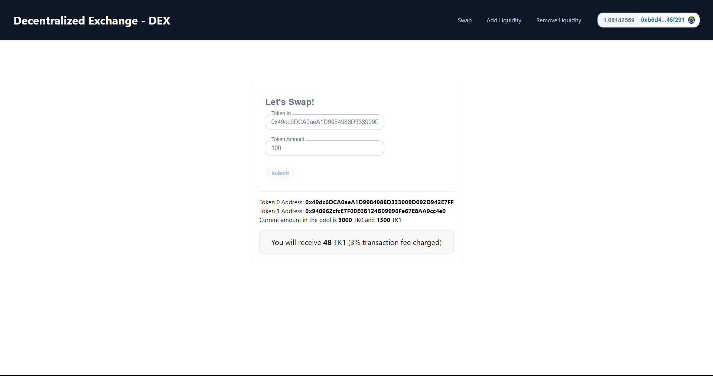
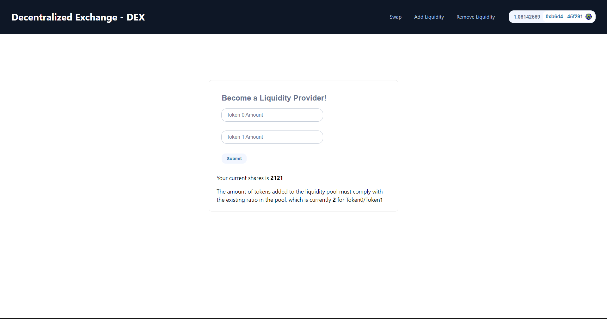
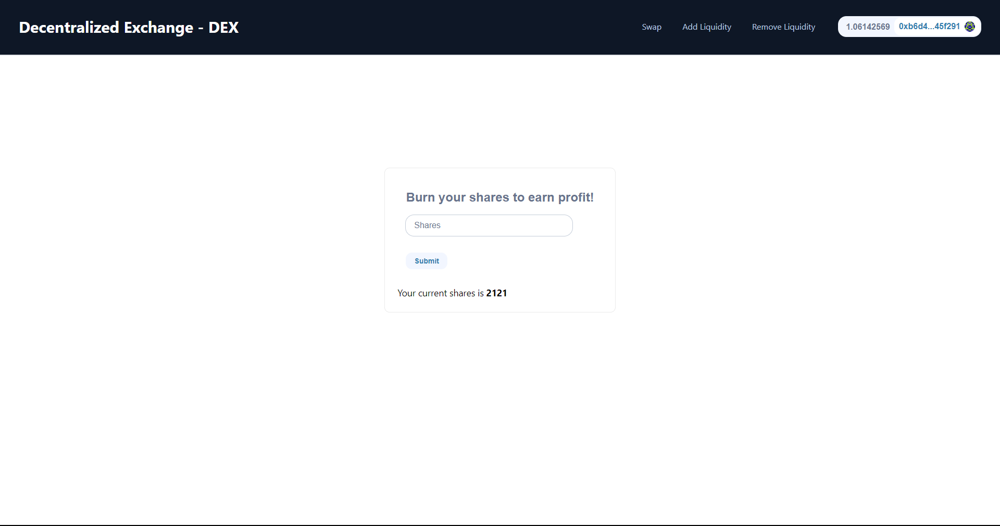

# NextJS Decentralized Exchange - DEX

<br/>
<p align="center">

</a>
</p>
<p align="center">

</a>
</p>
<p align="center">

</a>
</p>
<br/>

## 1. Git clone the contracts repo

In it's own terminal / command line, run: 

```
git clone https://github.com/veoquynhs/dex.git
cd dex
yarn
```

## 2. Deploy to Sepolia 

1. Setup environment variabltes

You'll want to set your `SEPOLIA_RPC_URL` and `PRIVATE_KEY` as environment variables. You can add them to a `.env` file.

- `PRIVATE_KEY`: The private key of your account (like from [metamask](https://metamask.io/)). **NOTE:** FOR DEVELOPMENT, PLEASE USE A KEY THAT DOESN'T HAVE ANY REAL FUNDS ASSOCIATED WITH IT.
  - You can [learn how to export it here](https://metamask.zendesk.com/hc/en-us/articles/360015289632-How-to-Export-an-Account-Private-Key).
- `SEPOLIA_RPC_URL`: This is url of the Sepolia testnet node you're working with. You can get setup with one for free from [Alchemy](https://alchemy.com/?a=673c802981)

2. Get testnet ETH

Head over to [faucets.chain.link](https://faucets.chain.link/) and get some tesnet ETH. You should see the ETH show up in your metamask.

3. Deploy

After getting testnet ETH, deploy your own token contracts to sepolia. You can modify the name & symbol of the token in `deploy/01-deploy-erc20-token.js` (Remember you need 2 token contracts):

```
yarn hardhat deploy --network sepolia --tags token
```

Then, paste the address of the 2 new token contracts you just deployed to the `arguments` const in `deploy/02-deploy-dex.js` and deploy your own DEX contracts to sepolia:

```
yarn hardhat deploy --network sepolia --tags dex
```

## 3. Start your UI

Make sure that:
- In your `networkMapping.json` you have an entry for `Token0`, `Token1` and `DEX` on the Sepolia network. 

```
yarn dev
```

